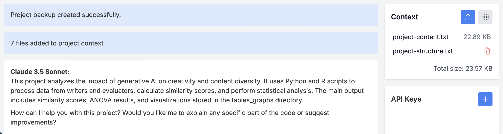
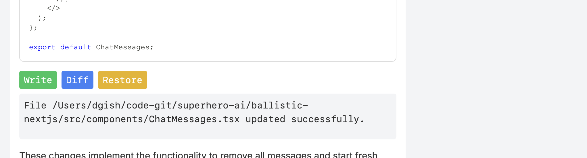

# Ballistic: Radical Software Development 🚀

Ballistic supercharges the latest SOTA LLMs like Claude 3.5, transforming chats into software development sessions. Put away the editor - work in broad strokes and go Ballistic.

Your software project is automatically added into the chat context.



Write/Execute/Diff/Undo operations allow you to work with LLM outputs with confidence and ease.



The results will blow you away.

## Getting Started

1. Clone the repository:
   ```
   git clone https://github.com/djgish485/ballistic-ai.git
   cd ballistic-nextjs
   ```

2. Install dependencies:
   ```
   npm install
   ```

3. Start Ballistic:
   ```
   npm run dev -- /path/to/your/project
   ```

4. Open your browser and navigate to:
   ```
   http://localhost:3000
   ```

5. Add your API keys in the Ballistic interface:
   - [Get Claude API key](https://www.anthropic.com/api)
   - [Get OpenAI API key](https://platform.openai.com/account/api-keys)

## Quick Start Guide

1. **Initiate**: Click 'Start' to begin. Ballistic automatically creates a project backup and adds crucial files to the AI context.
2. **Enhance**: Add extra context by uploading additional files (e.g., requirements docs).
3. **Interact**: Engage with the AI to analyze, modify, or generate code. Expect and request full file outputs.
4. **Execute**: Use the Execute/Write/Diff/Undo buttons to manage code changes directly from the chat.

## Tips

- **API Selection**:
  - Claude 3.5 (Recommended): Ideal for complex tasks with 8192 token output.
  - GPT-4o: Faster with higher rate limits, suitable for simpler tasks.
- **Context Validation**: 
  - Review `project-content.txt` to ensure critical files are included in the AI context.
  - For large projects, manage context size by editing context settings to only include relevant paths.  
- **Debugging**: Click "Tips" below the input box to add handy prompts like: "List a couple hypotheses why and add log messages to figure it out."
- **Full Files**: Ballistic relies upon and encourages the LLMs to output full files. If a file does get truncated, simply remind the AI to show you the full file.
- **Manage**: Keep chats manageable by clicking "Next Modification" or refreshing the page when you're confident a modification is finished.

## A New Paradigm

- Ballistic was created entirely via prompting. The .modification-prompts directory contains a log of the prompts used to create Ballistic. 

## License

[MIT](https://choosealicense.com/licenses/mit/)

---

Embrace the future of software development with Ballistic – where AI and human creativity converge.