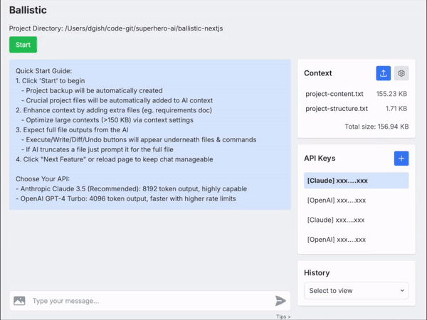

# Ballistic: Radical Software Development 🚀

Ballistic supercharges the latest SOTA LLMs like Claude 3.5, transforming chats into software development sessions. Put away the editor - work in broad strokes and go Ballistic.



Your software project is automatically added into the chat context. Write/Execute/Diff/Undo operations allow you to work with LLM outputs with confidence and ease. The results will blow you away.

## Getting Started

1. Clone the repository:
   ```
   git clone https://github.com/djgish485/ballistic-ai.git
   cd ballistic-nextjs
   ```

2. Install dependencies:
   ```
   npm install
   ```

3. Start Ballistic:
   ```
   npm run dev -- /path/to/your/project
   ```

4. Open your browser and navigate to:
   ```
   http://localhost:3000
   ```

5. Add your API keys in the Ballistic interface:
   - [Get Claude API key](https://www.anthropic.com/api)
   - [Get OpenAI API key](https://platform.openai.com/account/api-keys)

## Tips

- **API Selection**:
  - Claude 3.5 (Recommended): Ideal for complex tasks with 8192 token output.
  - GPT-4o: Faster with higher rate limits, suitable for simpler tasks.
- **Diff button** 
  - Use it liberally to catch hallucinations (GPT-4o's tendency) and file truncations (Claude's tendency).
- **Edit buttons** 
  - Hovering over your message shows a pencil icon to edit if you weren't satisfied with the AI response.
  - Hovering over a code block shows a pencil icon on top, to make small changes to the AI output.
- **Image button**
  - Send images and screenshots along with your message to help describe your request (Claude only). 
- **Tips link**
  - Click "Tips >" underneath the input box to see helpful prompts to add to your message.
  - These show best practices we've found to help debug and problem solve.
  - Click on a prompt to append to your message.
- **Context Validation**: 
  - Review `project-content.txt` to ensure critical files are included in the AI context.
  - For large projects, manage context size by editing context settings to only include relevant paths.  
- **Manage**: Keep chats manageable by clicking "Next Modification" or refreshing the page when you're confident a modification is finished.

## A New Paradigm

- Ballistic was created entirely via prompting. The .modification-prompts directory contains a log of the prompts used to create Ballistic. 

## License

[MIT](https://choosealicense.com/licenses/mit/)

---

Embrace the future of software development with Ballistic – where AI and human creativity converge.